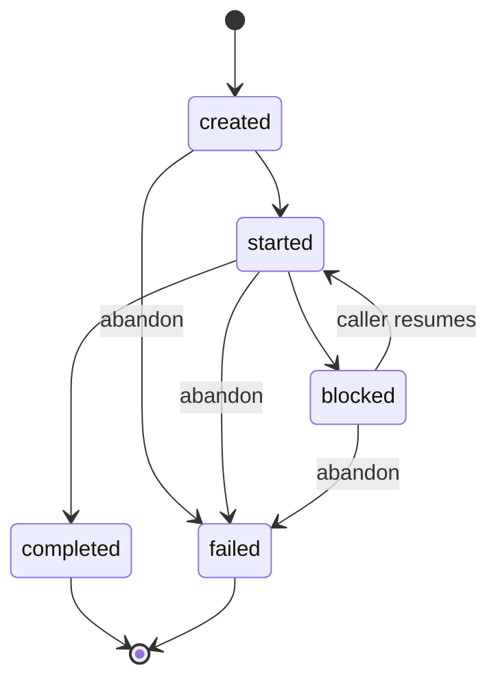
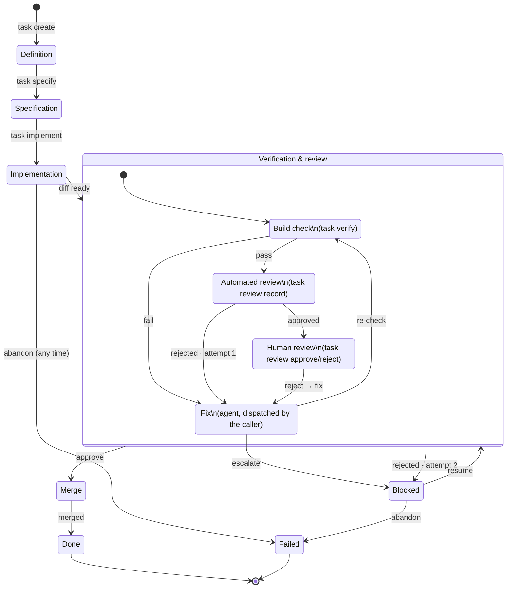

# taskman: a file-backed task server, no database, no execution, no GitHub

taskman holds tasks, prompts, and configuration as files, validates and records state
transitions reported to it, and executes almost nothing itself - no build checks, no commits, no
merges, no LLM calls. The one exception is creating a task's own worktree and branch (§5) - a
single, narrowly-scoped, deterministic git operation taskman performs directly, guarded by its
own precondition. Everything else that requires judgment or execution is done by whatever calls
taskman, and reported back.

## 0. Two kinds of caller, and taskman itself

Three things exist, and only one of them is this repo.

**taskman - this repo.** Knows *what to do*, never decides *when*, and executes almost nothing
itself - not `go vet`, not `git commit`, not `git merge`; those are reported to it, never run by
it. The one exception is `git worktree add` at `task create` time (§5) - a single deterministic
setup step, guarded by its own clean-working-tree precondition, that has to happen exactly once
before any caller can start work. taskman owns the data and the state machine: `config.yaml`,
`.tasks/*.yaml`, `prompts/*.md`, and the process-stage rules in §6 (what's pending, what a
rejection or an escalation means, what unblocks a task). It validates that a reported transition
is legal and records it. Exposed as a CLI first, HTTP and MCP after (§8). taskman assumes
**nothing** about whether anything is even listening: it never spawns a sub-agent, never calls a
model API, never assumes a particular caller exists on the other end. It answers "what's the
state of this task, what should happen next, here's the prompt for that" when asked, and accepts
"here's what happened, record it" when told.

**A harness** - unnamed, generic, not a project this design owns. This very kind of session
(Claude Code), or opencode, Codex, or any other MCP/CLI-capable agent runtime with sub-agent
support, used directly and interactively: a human (or the harness's own running LLM session)
calls taskman to read a task's state and its prompt, spawns its own sub-agents to do the
implement/review/fix work using whatever tools *it* already has, and calls taskman back to
record outcomes. taskman is just another tool surface to it, same as any other MCP server or CLI
it knows how to drive. A human sitting in a chat session, polling `task next` by hand or asking
their harness to, is a complete, valid way to work a task - nothing requires more than this.

**loop - the operator, its own separate project, not in this repo.** No LLM inside it - a plain,
code-only program whose job is to run *unattended*: on a schedule, with nobody sitting in a chat
session, it polls taskman (`task next`) and drives a harness (the kind above) on its own behalf
to actually do the work - shelling out to an agent CLI, calling a model API directly, whatever
it's built against - then reports the result back the same way a human-driven harness would.
loop is what makes progress happen without a human present; it is not itself the thing with
judgment (that's still whatever harness it drives) - it's the scheduler/glue that decides *when*
to invoke one.

Either kind of caller can be present, both can, or neither - taskman can't tell, and doesn't get
to assume: a task can sit in `.tasks/` indefinitely with nothing happening, and that's a valid,
unremarkable state, not an error condition. Whether anything is watching is entirely outside
taskman's knowledge.

## Config vs. content

- **`config.yaml`**: infrastructure config. Small, fixed set of sections, changes rarely, one
  file, no secrets to hold (§1).
- **`.tasks/*.yaml` and `prompts/*.md`**: content. Grows without bound, authored by humans or
  agents, no secrets, meant to be `git diff`-able and read on their own.

`dirs` only names directories that hold one-file-per-item content: `tasks`, `worktrees`,
`prompts` (`git` names the repo root the whole system operates against).

## 1. Config

### File and loading

taskman is fully offline - no network calls of its own, ever (no provider APIs, no GitHub, no
telemetry) - and has very little to configure as a result: no credentials to keep out of git, no
secrets, nothing that benefits from environment-variable indirection.

- `config.yaml` at the repo root (path overridable via `--config` flag).
- Everything under a single top-level `taskman:` key.
- Loading: `yaml.Unmarshal` the file directly into `Config`, then `Config.Validate()`. No `.env`
  loading, no `${VAR}`/`$VAR` interpolation - both existed only to keep secrets out of a
  committed file, and there are no secrets in this schema to protect.
- Logging verbosity is a CLI flag (`--log-level`, `--log-format`), not persistent config - a
  one-shot process has no reason to carry a standing logger configuration between invocations.

### Schema

```yaml
taskman:
  dirs:
    git: .
    tasks: .tasks
    worktrees: .worktrees
    prompts: prompts
```

That's the whole file. `dirs.git` is the repository root taskman operates against (worktrees,
commits) - default `.`, overridable for running taskman against a repo other than the one it's
checked out in. No provider/model config: taskman doesn't know or track which model a task
should run on, any more than it knows what tools a caller has (§4) - that's entirely the
caller's own business (§3, §6, §8 have no `model` field or flag anywhere). No `sqlite:` section -
there's no database (§2). No `server:` section - the CLI is one-shot, not a persistent process
(§8); if an HTTP/MCP `serve` mode is ever built, its config lives with that mode, not here.

## 2. No database

Tasks and prompts are files; sessions are an opaque id string, not a file taskman owns (§7).
Nothing left needs a relational store - no `internal/store`, no migrations, no `modernc.org/sqlite`
dependency.

| Data | Lives in |
|---|---|
| Server/logger config | `config.yaml` |
| Prompt templates | `prompts/*.md` |
| Tasks, labels | `.tasks/*.yaml` |
| Build-check attempts | `.tasks/*.yaml` (`verifications:` list) |
| Review attempts | `.tasks/*.yaml` (`reviews:` list) |
| Task↔session linkage | `.tasks/*.yaml` (`sessions:` list of opaque id strings, §7) |
| Sessions, turns, tool calls, token usage | not taskman's data at all - whatever harness ran the turn owns this, wherever it keeps it |
| Tool catalog | not taskman's data at all - taskman has no tools, no tool registry, no schema field for them anywhere |

This is a from-scratch start: no existing database content migrates forward into files.

## 3. Tasks as files

### Location and identity

One file per task: `.tasks/<id>.yaml`. `id` is the filename stem - a short, lowercase,
URL/branch-name-safe slug, either given by whoever creates the task or generated as a short
random id (regenerated on collision). `task/<id>` becomes a readable git branch name, and task
files are meant to be listed and opened by a human.

**No task YAML file is ever written by hand, including by its own creator.** Every write -
create, update, a stage advancing, a human recording a review decision - goes through taskman's
own command functions (§8), which own the read-modify-write-rename cycle and validation. A
human's own interaction with a task is: read the file, inspect the worktree, then invoke a
taskman command that writes the file on their behalf.

### Schema

```yaml
task:
  id: abc
  title: Test Task
  labels:
    type: doc-drift
    priority: high
    complexity: low
    autonomy: high
  definition: |
    ...
  specification: |
    ...
  done_when: |
    ...
  references:
    - internal/balance/README.md:11
    - types.go:11-14
  status:
    definition:     { state: done, completed_at: "2026-08-31T22:46:14+03:30" }
    specification:  { state: done, completed_at: "2026-08-31T22:47:00+03:30" }
    implementation: { state: done, completed_at: "2026-08-31T23:10:00+03:30" }
    verification:   { state: done, completed_at: "2026-08-31T23:40:00+03:30", attempts: 2 }
    review:         { state: done, completed_at: "2026-08-31T23:55:00+03:30" }
    merge:          { state: pending }
  git:
    worktree: .worktrees/abc
    branch: task/abc
    commit:
      type: feat
      message: |
        ...
      hash: 12345asdf
  verifications:
    - checks: { vet: ok, lint: error, test: ok }
      output: |
        lint: internal/balance/balance.go:42: error not checked
      session: claude-code:8f21c9a0
      created_at: "2026-08-31T23:15:00+03:30"
    - checks: { vet: ok, lint: ok, test: ok }
      session: claude-code:8f21c9a0
      created_at: "2026-08-31T23:35:00+03:30"
  reviews:
    - attempt: 1
      approved: false
      session: claude-code:8f21c9a0     # opaque - whatever id the dispatching harness uses (§7)
      findings:
        - file: internal/balance/balance.go
          summary: missing error check
      created_at: "2026-08-31T23:20:00+03:30"
    - attempt: 2
      approved: true
      session: claude-code:8f21c9a0
      created_at: "2026-08-31T23:38:00+03:30"
  human_reviews: []          # same shape as reviews[], but from `task review reject` (§6)
  sessions:
    - claude-code:8f21c9a0   # every session dispatched for this task, in dispatch order
    - opencode:4b7e0d3f
  # blocked is present only while task.State: blocked (§6's "blocked overlay"); omitted otherwise.
  # blocked:
  #   stage: verification
  #   reason: |
  #     Second review rejected: still missing error handling in balance.go:42
  #   at: "2026-09-08T12:00:00Z"
```

This task is shown at the point where a human has just approved (`review.state: done`) and the
commit has been made, awaiting `task merge` - the first automated review round found a real
issue (attempt 1, rejected), a fix went in, and attempt 2 was clean.

Notes:
- `status` stages run `definition → specification → implementation → verification → review →
  merge`, matching `notes/process.md`'s stage list - *automated* review lives inside
  `verification`, and `review` is the human gate. Each stage is `{state, completed_at}`, plus an
  `attempts` counter where a stage can retry (`verification` only, §6). No `started_at`: no
  command in this design ever reports "I've begun this stage but not finished" as a distinct
  event from "here's the outcome" - even `review`'s `in_progress` (the one real multi-value
  stage) doesn't have a clean single start/end pair once more than one reject cycle happens, so a
  field that would be `null` or ambiguous more often than not isn't worth carrying.
- `verifications`/`reviews`/`sessions` make a task file self-contained and portable - its full
  history travels with a `git mv` or a copy. `sessions` records the opaque session id (§7) of
  every session dispatched for this task, in dispatch order; a review's (or verification's)
  `session` field points at the specific one that produced it.
- `verifications` is an append-only log of every `task verify` call - one entry per attempt, not
  just the latest, so a blocked task's history shows exactly which check failed and when, not
  just an aggregate pass/fail. `checks` is whatever check names the caller reported that time
  (`vet`/`lint`/`test` here, but not fixed by taskman - it's whatever the caller actually ran);
  each value is `ok` or `error`. No separate pass/fail flag - a verification attempt passed if
  every reported check is `ok`. `output` is one free-text field for the whole call, not
  per-check - if several checks fail in the same attempt, their output is whatever the caller
  concatenated into that one string; `checks` is what's structured, `output` is just supporting
  detail for a human to read.
- `labels` is a free-form `map[string]string`. A small set of well-known keys - `priority`,
  `complexity`, `autonomy`, each one of `low`/`medium`/`high` - are validated against that fixed
  enum when present. Every other key, including `type` in the example above, is an unchecked
  plain user tag - `type` isn't in the validated set despite being the most prominent example
  here; worth remembering since it's easy to assume otherwise from this schema alone.
- `human_reviews` is the human-review counterpart to `reviews[]` (which is only ever written by
  the automated reviewer). `blocked` is present only while `task.State: blocked`, and records
  which stage was in flight and why, rather than giving any stage its own "stuck" value (§6).
- `task.State` (top-level, coarse) is one of `created`, `started`, `blocked`, `completed`,
  `failed` - no `cancelled`: it would only ever mean "abandoned before any work happened," which
  `failed` (via `task abandon`) already covers.

### Repository implementation

- **Read**: `os.ReadFile` + `yaml.Unmarshal`. Listing reads every `*.yaml` in the directory and
  filters in Go - no query planner to lean on, fine at this scale.
- **Write**: marshal to YAML, write to `<id>.yaml.tmp` in the same directory, `os.Rename` over
  the final path - atomic on the same filesystem, so a crash mid-write never leaves a
  half-written or corrupt task file.
- **Concurrency**: `taskman` is a one-shot CLI - each invocation is its own process that reads,
  validates, writes, and exits, not a long-running daemon holding an in-memory lock table between
  calls. Two invocations touching the same task at nearly the same moment are two separate OS
  processes, so the read-modify-write-rename cycle takes a real OS-level advisory lock on the
  task file (`flock`, held for the duration of the read-modify-write) rather than an in-process
  mutex - a per-process lock would provide no protection at all here, since there's no shared
  process for it to live in.
- **Delete**: removes the file outright, no soft-delete/tombstone - git history covers "undo."
- **IDs**: plain strings, not UUIDs.

## 4. Prompts as files

taskman has no tools and no notion of which model a task should run on (§3) - what's left to hand
a caller, for a stage that needs judgment, is exactly one thing: **text a human would otherwise
have to type into a prompt by hand.** That's a prompt file.

### Location and format

One file per stage-role, plain Markdown, no wrapper format: `prompts/specify.md`,
`prompts/implement.md`, `prompts/fix.md`, `prompts/review.md`, `prompts/commit.md`. Each is a
**user-prompt template only** - deliberately no system-prompt file, since not every harness lets
a caller override the system prompt; taskman doesn't assume that capability exists on the other
end. `{{ .Field }}` placeholders, rendered with Go's `text/template` against the task's own
fields:

```markdown
Draft a specification and acceptance criteria (`done_when`) for this task.

## Definition
{{ .Definition }}

## References
{{ range .References }}- {{ . }}
{{ end }}
```

Each file holds only the judgment-specific content - what to decide, what to look at - not the
worktree path, the branch, or what to report back with. Those are the same on every dispatch
regardless of stage, so taskman generates them once and wraps the rendered prompt in that common
preamble/postamble itself (§8's `task next`) rather than have every prompt file repeat them.
`task next`'s `dispatch` response carries the fully wrapped, rendered text as `message` - the
caller never touches `prompts/*.md` directly and never has to assemble the pieces itself.
Lookup is `os.ReadFile("prompts/<name>.md")` plus `text/template` rendering, on demand, no
caching required at this scale. The built-in prompts (`specify`, `implement`, `fix`, `review`,
`commit`) ship checked into the repo as plain defaults - nothing to seed, no database.

## 5. No GitHub

taskman has no GitHub integration - no issue polling, no PR creation, no webhook. A task file
existing under `.tasks/` **is** the opt-in for working it; a human (or another agent) creating
the file is the deliberate act. There's no separate enable/disable flag - pausing a task is what
the `blocked` state is for.

**Specification stage**: a task created with only `definition` filled in (`status.specification.
state: pending`) gets `specify` dispatched (§8's `task next`) to draft `specification`/
`done_when` from `definition` and any `references`, written back into the task file. A task
authored with `specification`/`done_when` already filled in skips straight to `implementation`.

**Git and worktrees**: `task create` is the one place taskman executes git itself (§0). Before
writing anything, it checks the working tree at `dirs.git` is clean (`git status --porcelain`
empty) - if not, it errors and creates nothing, rather than leave a task file pointing at a
worktree that was never safely created. If clean, it runs `git worktree add .worktrees/<id> -b
task/<id>` against the local repo (no clone, no network, no remote required) and records the
result as `git.worktree`/`git.branch`. This is deliberately narrow: it's the one setup step nobody
else could safely do first (a caller can't dispatch `implement` into a worktree that doesn't
exist yet, and letting every caller create its own risks two callers racing to create the same
one) - every git operation *after* this point (build checks, commits, merges) stays
caller-executed and reported, per §6. Once created, the worktree is left in place for the rest of
the task's life, inspectable at any time (`cd .worktrees/<id>`).

**No push, no PR, no remote required**: the `review` stage is just human review of a worktree and
branch - there's no PR to create. The stage's own approve/reject actions (§6) are what a human
uses instead of reviewing a PR.

## 6. The task state machine

taskman never advances a task on its own - everything below is a set of **commands** a caller
invokes, each a guarded transition taskman validates and applies. taskman's whole job is: hold
the state, tell the caller what's legal to do next (`task next`, below), and refuse anything
that isn't. Every command here, including `task verify` and `task merge`, is the caller
*reporting* something it (or an agent it dispatched) already did - taskman never runs `go vet`,
`git merge`, or anything else itself. (`task create`'s worktree/branch setup, §5, is the one
exception in this whole design, and it happens once, before any of these commands are relevant.)

The stage split follows `notes/process.md`:

> **Verification** - automated verification, including lints, static code analysis, tests, and
> automated reviews... retry cap. **Review** - PR creation and human review... Ends in a commit.
> **Merge** - merge the PR into the codebase.

So the automated review round lives *inside* `verification`, not beside it; `review` is purely
the human gate; `merge` is its own terminal stage.

### States

**Task-level `state`:**



- `created` - task file exists, `definition` stage done, nothing else started.
- `started` - work is (or was) underway; the per-stage `status` block is the actual source of
  truth for where it stands.
- `blocked` - stopped short of a decision automation is allowed to make; see "The `blocked`
  overlay" below.
- `completed` - `merge` stage done.
- `failed` - a human gave up outright (`task abandon`). Terminal.

**The full mechanism**, every stage and the verification loop:



A hand-drawn SVG rendering of the same machine lives in `notes/design/task-fsm.html`.

**Per-stage `status.<stage>.state`:**

| Stage | Values | Notes |
|---|---|---|
| `definition` | `pending` → `done` | Done the moment `task create` is given a `definition` - a task without one doesn't exist yet. |
| `specification` | `pending` → `done` | Already `done` at creation if `specification`/`done_when` are provided up front; otherwise flips straight to `done` on `task specify`'s report - see below for why there's no `in_progress`. |
| `implementation` | `pending` → `done` | `done` means a diff exists, not that it's clean - the build check is `verification`'s job. |
| `verification` | `pending` → `done` | Owns the build-check-fix loop and up to two automated review rounds; `attempts`/`reviews[]` already show whether work has started, so a separate `in_progress` value would be redundant. Never holds a "stuck" value itself - see the `blocked` overlay. |
| `review` | `pending` → `in_progress` → `done` | The human gate - the only stage where `in_progress` is real, entered by `task review reject` and exited back to `pending` once the fix-and-recheck cycle clears (see "Review-reject recovery"). |
| `merge` | `pending` → `done` | Only two values. |

Only two values for `definition`/`specification`/`implementation`/`verification`, not three:
nothing in the command table (§6's "Commands," below) ever reports "I've started this stage but
haven't finished" - every command is a completed outcome. An `in_progress` value nothing sets is
worse than no value at all, so it's dropped for the stages where it would be unreachable.
`review` is the one exception because `task review reject` genuinely sets it, and something
later genuinely clears it.

### The `blocked` overlay

Rather than give any stage its own "stuck" sub-state, escalation is one task-level fact,
orthogonal to whichever stage was active:

```yaml
blocked:
  stage: verification       # which stage's work was in flight
  reason: |
    Second review rejected: still missing error handling in balance.go:42
  at: "2026-09-08T12:00:00Z"
```

Whatever stage was `in_progress` when `blocked` was set stays exactly as it was - a caller
resumes it later by calling the same command again (see "Unblocking," below). One field to check
for "is this stuck," one shape regardless of which stage triggered it.

Two things set it:
1. **`task escalate`** - a caller reporting that an agent it dispatched called its own `escalate`
   tool, on its own judgment, rather than keep iterating. Can happen from `implementation`,
   `verification`, or a review-reject recovery cycle.
2. **Verification's two-round cap** exhausting itself on a second automated-review rejection.

### Commands

Every row is something the caller invokes - a CLI subcommand, an HTTP route, or an MCP tool
(§8). Each has a precondition (a validation error if unmet, never a silent no-op) and an effect.

| Command | Precondition | Effect |
|---|---|---|
| `task create --definition <text> [--id <id>] [--title <text>] [--label k=v ...] [--reference <ref> ...] [--specification <text> --done-when <text>]` | working tree at `dirs.git` is clean | New task file. `definition` required; `id` generated if not given (regenerated on collision, §3). taskman itself creates `.worktrees/<id>` on branch `task/<id>` (§5's exception to "taskman never executes anything") and records them as `git.worktree`/`git.branch`. Errors instead of creating anything if the working tree isn't clean. `definition.state: done`; every other stage `pending`, `task.State: created` - unless `--specification`/`--done-when` are both given, in which case `specification.state: done` too, the specify stage is skipped (§5), and `task.State: started` immediately (matching what `task specify` would otherwise be the one command to set). |
| `task update <id> [--title <text>] [--label k=v ...] [--unset-label k ...] [--reference <ref> ...] [--clear-references]` | task exists | Patch semantics - only the fields given are changed, everything else on the task is untouched. No precondition on `task.State`/`status`: these are metadata, not workflow state, so a `completed`/`failed`/`blocked` task can still be relabeled without that implying anything about its progress. Doesn't touch `specification`/`done_when` (workflow content, own command: `task specify`) or `git`/`status` (taskman-managed, not user-editable). `definition` isn't editable at all, by any command - it's fixed at creation (§3: "a task without one doesn't exist yet"). |
| `task specify --result <spec> --done-when <text> [--session <ref>]` | `specification.state != done` | Writes `specification`/`done_when`; `specification.state: done`; `task.State: started`; appends the session ref to `sessions[]` if given. |
| `task implement [--session <ref>]` | `specification.state == done`, `implementation.state != done` | `implementation.state: done`; appends the session ref to `sessions[]` if given. (The diff lives in the worktree; this just marks an attempt exists.) |
| `task verify --check <name>=<ok\|error> ... [--output <text>] [--session <ref>]` | `implementation.state == done`, task not `blocked`/`failed` | The caller (or an agent it dispatched) ran the build checks itself (`--check vet=ok --check lint=error --check test=ok`, one per check actually run) and reports each outcome; overall pass/fail is `ok` for every `--check` given, not a separate flag - a caller can't report `passed` while also reporting a failing check. Appends to `verifications[]` (§3) and the session ref to `sessions[]` if given. Failed → recorded; expected to be followed by a fix and another `task verify` call. The `blocked`/`failed` guard matches `task review record`'s - a `blocked` task's two-round cap doesn't get quietly worked around by continuing the build-fix loop. |
| `task review record --approved <bool> [--findings ...] --session <ref>` | `implementation.state == done`, task not `blocked`/`failed` | Reports the automated review's verdict. Appends to `reviews[]` and the session ref to `sessions[]`. Approved → `verification.state: done`, `review.state: pending`. Rejected on attempt 1 → attempt becomes 2, stay in `verification`. Rejected on attempt 2 → `task.State: blocked` (`blocked.stage: verification`). |
| `task commit --type <type> --message <text> --hash <hash>` | `verification.state == done` | The caller already ran `git commit` itself (a new commit, never an amend); writes/overwrites `git.commit: {type, message, hash}` with the latest commit's details, and ensures `review.state: pending` (a no-op the first time - already `pending` - but this is what actually ends a review-reject-recovery cycle the second-or-later time, flipping it back from `in_progress`). Called once right after the automated review first approves, and again each time a review-reject-recovery cycle clears, each a distinct new commit on the branch (§ "When the commit happens"). `verification.state` stays `done` throughout recovery, so the same precondition covers every call. |
| `task escalate --stage <stage> --reason <text>` | task not already terminal | `task.State: blocked`, `blocked: {stage, reason, at: now}`. `stage` is one of `definition`/`specification`/`implementation`/`verification`/`review`/`merge` - whichever stage was in flight when the agent gave up. |
| `task review approve [--session <ref>]` | `review.state == pending` | `review.state: done`; appends the session ref to `sessions[]` if given - the same as a rejection's, so an approval leaves as much of a trace as a rejection does, not just a bare timestamp. |
| `task review reject --reason <text>` | `review.state == pending` | Records the rejection (`human_reviews[]`) and starts review-reject recovery (below); `review.state: in_progress` for its duration. |
| `task merge [--commit <hash>]` | `review.state == done` | The caller already ran `git merge` itself; records `merge.state: done`, `task.State: completed`. `--commit`, if given, overwrites `git.commit.hash` with the final merged commit (only differs from what `task commit` recorded for a non-fast-forward merge). |
| `task abandon --reason <text>` | task not already `completed` | `task.State: failed`, reason recorded. Terminal. |
| `task delete` | task exists | Removes the task file outright (§3 - no soft-delete). No restriction on `task.State`/`status`: git history covers "undo," so there's nothing this precondition would protect against. A human housekeeping action, not exposed to loop or any harness (§8). |
| `task next` | - | Read-only; see below. |

### `task next`: what tells the caller what to do

The "guide it, tell it what to do, give it prompts" interface. Given a task id, it inspects
`status` and returns one of:

- **Dispatch this** - the task is at a stage needing judgment (`specification`, `implementation`,
  the fix half of `verification`, drafting the commit message once verification passes or a
  review-reject-recovery cycle clears, or the fix half of a review-reject-recovery cycle): the
  rendered `prompts/<name>.md` text for that stage, and which command to report the result with.
- **Run this yourself** - the task is at `verification`'s build check or at `merge`: no prompt to
  give, since neither needs judgment - run the check or the merge however you like and call
  `task verify` / `task merge` to report what happened.
- **Wait** - `review.state: pending` or `task.State: blocked`: the next move belongs to a human,
  not the caller. Still an open task, just not one to act on right now.
- **Done** - `task.State` is `completed` or `failed`: over, nothing will change again.

A caller that only ever calls `task next` in a loop and does what it says is, by construction,
correctly driving the state machine above.

### Giving up: the `escalate` command

Neither the build-check-fix loop nor a post-rejection fix round gets a numeric retry cap.
Instead, whatever agent is dispatched for implement/fix work is expected to have its own
`escalate` tool available - the caller's own concern, not something taskman provides or
executes - and when that tool is called, the caller reports it via `task escalate`. This is the
*only* bound on the build-check-fix loop - `blocked` has two distinct triggers worth telling
apart in the recorded reason ("the agent chose to stop" vs. "two automated review rounds
rejected it"), but both land on the same state and the same recovery path. The two-round review
cap and `escalate` are independent - a task can be blocked by either one, whichever comes first.

### The `verification` stage, in full

One `verification` pass is: a deterministic build check (`go vet`/`make lint`/`go test`, run by
the caller or an agent it dispatches, reported via `task verify`) followed by one automated
review round (an agent the caller dispatches, reported via `task review record`), against the
worktree as it stands. This gets **two attempts** before escalating, on top of either side
reporting `escalate` at any point:

1. **Attempt 1**: run the build checks, then call `task verify --check <name>=<ok|error> ...` to report each one.
   - Fails → the caller dispatches a fix agent with the failure output, then runs the build
     check and calls `task verify` again - repeating until it passes or the agent escalates.
   - Passes → the caller dispatches a review agent, given both `specification` and `done_when`
     as its acceptance criteria, then reports the verdict via `task review record`.
     - Approved → `verification.state: done`, advance to `review`.
     - Rejected → the caller dispatches a fix agent with the review's findings, then repeats
       from `task verify` for attempt 2.
2. **Attempt 2** (only reached after a review rejection): same shape as attempt 1.
   - Approved → `verification.state: done`, advance to `review`.
   - Rejected → `task.State: blocked` (`blocked.stage: verification`), reason summarizing the
     second rejection. A **fixed two-round cap for every task** - a task's `autonomy` label
     doesn't change it; predictability was preferred over per-task tunability here.

`status.verification.attempts` records which attempt (1 or 2) the task settled on; `reviews[]`
has the full per-attempt detail. A `blocked` task isn't retried automatically.

### The `review` stage: human, out of band, program-mediated

The human reviews a **real commit** on the branch - `cd .worktrees/<id>`, `git log`/`git diff`
against the base branch, their own IDE/git tooling; no in-tool diff viewer. The commit already
exists by the time this stage is reached (§ "When the commit happens" - it's made the moment
automated review approves, before `review` is ever entered). What's needed is a way to record
their decision without ever hand-editing the task's YAML file: `task review approve`, `task
review reject --reason ...`, `task abandon --reason ...` (the release valve - a human is never
stuck rejecting forever just to avoid giving up).

### Review-reject recovery

A human rejection re-enters automation exactly once per rejection, but skips the automated
review agent on the way back - the human is now the reviewer for this task:

1. `task review reject` records the rejection in `human_reviews[]`; the caller dispatches a fix
   agent with the human's stated reason (`escalate` still available).
2. `task verify` re-runs (fix-and-recheck loop, same as verification's own) until clean or
   escalated.
3. Once clean, the caller drafts a message (`prompts/commit.md` again) for **a new commit** -
   not an amend of the first one - addressing the human's feedback, and reports it via
   `task commit`, whose effect resets `status.review.state` to `pending` (§6's command table).
   The task is back in front of the human, now looking at a second commit on top of the first.

This can repeat indefinitely, which is fine precisely because `task abandon` exists as the
explicit way out. Each cycle that clears adds one more commit to the branch, never rewriting a
previous one - a human re-reviewing after a rejection sees exactly what changed since their last
look, not the whole diff again.

### When the commit happens

Right when `verification.state` first reaches `done` - i.e., the moment automated review
approves, whether on attempt 1 or attempt 2 - **not** at `merge`, and never for a task that ends
up `blocked` instead (attempt 2's rejection sets `blocked` without ever setting
`verification.state: done`, so the commit trigger simply never fires for it - nothing worth
committing if verification never actually passed). At that point the caller drafts a commit
message (`prompts/commit.md`, dispatched via `task next`, §8), runs `git commit` itself, and
reports it via `task commit` - this is what the human at `review` is looking at. A human
rejection doesn't touch that commit; it adds a new one on top (see "Review-reject recovery"
above), so a task can end its life with one commit (no human rejections) or several (one per
rejection cycle), but never zero once it's reached `review` at all, and never an amend.

### Unblocking a `blocked` task

There's no separate "unblock" command, and no table mapping `blocked.stage` values to a specific
resume command - `blocked.stage` is informational (what a human reads to know where to look),
not a lookup key. Resuming means calling `task next` again: it inspects the *whole* current state
(`verification`/`review` states, `attempts`, `reviews[]`), not just `blocked.stage`, so it can
always tell exactly which command is next - the build-check-fix loop, an automated review, or a
review-reject-recovery cycle - the same way it would for any non-blocked task. `blocked` clears
the moment that command succeeds. A human intervening first (fixing something in the worktree
themselves, adjusting the specification) and then re-running a caller against the task *is* what
unblocks it. `task abandon` is always available instead.

## 7. Sessions: an opaque id, not a file

Recording *how* an agent turn went (its tool calls, its token usage, its own crash recovery) is
an execution detail that belongs to whichever harness ran the turn, not to taskman. taskman never
runs a turn, so it has no transcript to own - there is no session directory, no session file
format, nothing to crash-recover on taskman's side for this.

What taskman needs is a way to say "this stage was worked by that piece of work" without caring
what produced it. Every place that takes a `session` value (a task's `sessions:` list, a
`reviews[]`/`human_reviews[]` entry's `session` field, the `--session <ref>` flag on
`specify`/`implement`/`verify`/`review record`/`review approve`) is exactly that: **an opaque
string, supplied by whatever
dispatched the agent, meaning whatever that harness's own session/transcript id means to it** - a
Claude Code session id, an opencode session id, a Codex session id, or nothing at all if the
caller has no such concept. taskman stores it, returns it unchanged in `task get`/`task next`
responses, and never parses, opens, or assumes a format for it. Looking up what actually happened
in a session means taking its id to whatever tool produced it - not to taskman.

## 8. The taskman interface: CLI, HTTP API, MCP

Everything in §6's command table is reachable three ways: a human at a terminal, a harness or
loop calling over HTTP, and either calling as MCP tools. CLI is the priority to build first, and
is the primary mode taskman runs in: `taskman task verify abc --check test=ok` is a complete
process lifecycle - open what it needs, validate, write, print, exit. There is no persistent
`taskman` daemon behind it. HTTP and MCP, when built, are a distinct, long-running server mode
invoked explicitly (a `serve` subcommand or similar) - separate from, and not required for,
ordinary one-shot CLI use.

### One core, three thin adapters

Every command in §6 gets **one Go function** in `internal/task`, alongside the repo functions it
calls - not three separate implementations. The CLI, the HTTP handler, and the MCP tool are each
a few lines that parse their own surface's input into the same request struct, call the same
function, and render the same result their own way:

```go
package task

// Command layer - one function per §6 command. Each: reads the task file, checks
// its precondition, applies the mutation via the same read-modify-write-rename
// cycle as UpdateTask (§3), and returns the updated Task or a dedicated result.

func Create(ctx context.Context, repo Repo, req CreateRequest) (Task, error)
func Update(ctx context.Context, repo Repo, id string, req UpdateRequest) (Task, error)
func Specify(ctx context.Context, repo Repo, id string, req SpecifyRequest) (Task, error)
func Implement(ctx context.Context, repo Repo, id string, req ImplementRequest) (Task, error)
func Verify(ctx context.Context, repo Repo, id string, req VerifyRequest) (Task, error)
func RecordReview(ctx context.Context, repo Repo, id string, req ReviewRecordRequest) (Task, error)
func Commit(ctx context.Context, repo Repo, id string, req CommitRequest) (Task, error)
func Escalate(ctx context.Context, repo Repo, id string, req EscalateRequest) (Task, error)
func ApproveReview(ctx context.Context, repo Repo, id string, session string) (Task, error)
func RejectReview(ctx context.Context, repo Repo, id string, reason string) (Task, error)
func Merge(ctx context.Context, repo Repo, id string, req MergeRequest) (Task, error)
func Abandon(ctx context.Context, repo Repo, id string, reason string) (Task, error)
func Next(ctx context.Context, repo Repo, prompts PromptRepo, id string) (Guidance, error)
func Delete(ctx context.Context, repo Repo, id string) error
```

(`ListTasks`/`GetTask` already exist and need no new command wrapper - they're plain reads.)
Every function validates a precondition against the current `status` and either applies the
write or returns a typed error - `ErrInvalidTransition{Stage, Have, Want}` or similar, one error
type reused by every command so the three adapters only need to handle it once each.

### The command table

| Command | HTTP | CLI | MCP tool |
|---|---|---|---|
| List | `GET /tasks` | `taskman task list [--state ...] [--label ...] ...` | `task_list` |
| Get | `GET /tasks/{id}` | `taskman task get <id>` | `task_get` |
| Create | `POST /tasks` | `taskman task create --definition <text> [--id ...] [--title ...] [--label k=v ...] [--reference ...] [--specification ... --done-when ...]` | `task_create` |
| Update | `PATCH /tasks/{id}` | `taskman task update <id> [--title ...] [--label k=v ...] [--unset-label ...] [--reference ...] [--clear-references]` | `task_update` |
| Specify | `POST /tasks/{id}/specify` | `taskman task specify <id> --result <text> --done-when <text> [--session <ref>]` | `task_specify` |
| Implement | `POST /tasks/{id}/implement` | `taskman task implement <id> [--session <ref>]` | `task_implement` |
| Verify | `POST /tasks/{id}/verify` | `taskman task verify <id> --check <name>=<ok\|error> ... [--output <text>] [--session <ref>]` | `task_verify` |
| Review record | `POST /tasks/{id}/review/record` | `taskman task review record <id> --approved=<bool> [--finding file:summary ...] --session <ref>` | `task_review_record` |
| Commit | `POST /tasks/{id}/commit` | `taskman task commit <id> --type <type> --message <text> --hash <hash>` | `task_commit` |
| Escalate | `POST /tasks/{id}/escalate` | `taskman task escalate <id> --stage <stage> --reason <text>` | `task_escalate` |
| Review approve | `POST /tasks/{id}/review/approve` | `taskman task review approve <id> [--session <ref>]` | `task_review_approve` |
| Review reject | `POST /tasks/{id}/review/reject` | `taskman task review reject <id> --reason <text>` | `task_review_reject` |
| Merge | `POST /tasks/{id}/merge` | `taskman task merge <id> [--commit <hash>]` | `task_merge` |
| Abandon | `POST /tasks/{id}/abandon` | `taskman task abandon <id> --reason <text>` | `task_abandon` |
| Next | `GET /tasks/{id}/next` | `taskman task next <id>` | `task_next` |
| Delete | `DELETE /tasks/{id}` | `taskman task delete <id>` | *(not exposed - see below)* |

`Delete` stays off the MCP surface deliberately - no caller (harness or loop) has a legitimate
reason to delete a task file as part of doing its job; that's a human housekeeping action,
CLI/HTTP only. Every command's name matches its Go function 1:1 across surfaces (`Specify` →
`task specify` / `task_specify` / `POST .../specify`) - no surface invents its own vocabulary.

### Shared request/response shapes

Each `*Request` struct lives once in `internal/task` and is what every adapter parses into:

- HTTP: `requestFromHTTP(r *http.Request) (Request, error)` - path value for `id`, JSON body for
  the rest.
- CLI: `urfave/cli` v3 flags mapping onto the same struct's fields.
- MCP: a `jsonschema`-inferred input struct next to the tool registration, converted to the
  shared `Request`.

Responses are the `Task` (or `Guidance`) marshaled the same way in all three: JSON for HTTP
(the only shape that transport has) and the MCP tool's typed output struct (same reasoning). For
CLI, the full JSON envelope is always available behind `--json` (a persistent root-command flag,
for scripting/piping); the *default*, unflagged output prints only `message` - or, for commands
that return a `Task` rather than `Guidance`, a short human-readable summary in the same spirit,
not a dump of the YAML. `task create`'s summary is where "taskman tells the caller about the
worktree it just made" (this turn's opening ask) actually happens - not deferred to the first
`task next` call:

```
Created task abc ("Test Task"). Worktree: .worktrees/abc, branch: task/abc.
```

`task next`'s `action`/
`report_with` fields exist specifically for **loop**, which has no LLM (§0) and can't act on
prose at all; `--json` is how it gets them. A harness or a human just reads `message`.

### Errors, one taxonomy, three renderings

| Error | HTTP | CLI | MCP |
|---|---|---|---|
| `task.ErrTaskNotFound` | 404 | exit 1, `task not found: <id>` | tool error, message |
| `task.ErrInvalidTransition` | 409 | exit 1, states the precondition that failed | tool error, message |
| `task.ErrWorkingTreeDirty` (`task create` only, §5) | 409 | exit 1, `working tree at <dirs.git> is not clean` | tool error, message |
| malformed input | 400 | exit 2 | tool error, message |
| unexpected/internal | 500 | exit 1, generic message + logged detail | tool error, generic message |

No auth on the HTTP surface - taskman is a strictly local tool.

### `task next`: taskman talks, the caller listens

The guiding principle for this whole interface, stated once here because it applies everywhere:
**taskman talks to whatever's calling it the way a person talks to an agent they've delegated
work to - not a data feed an agent has to reverse-engineer intent from.** A harness reading
`task next`'s response should feel briefed, the way this session is briefed by a message in this
conversation: told where to work, what the situation is, and what's expected back, in prose - not
handed a pile of separate fields (`worktree`, `since`, `attempts`, `blocked_reason`,
`last_findings`, ...) it has to reassemble into a sentence itself before it can act or brief a
human. Every `prompts/*.md` file already renders to natural language (§4); `task next` extends
that the same way to every response it gives, not just the ones that hand off a prompt.

Concretely, every response has:

```json
{ "task_id": "abc", "action": "...", "message": "...", "report_with": "..." }
```

- `action` is a coarse signal for a caller with no way to read prose - specifically **loop** (§0
  has no LLM inside it, so it can't act on a paragraph the way a harness can): `dispatch`,
  `run`, `wait`, or `done`. loop's whole job reduces to branching on this one field and, for
  `dispatch`, handing `message` to whatever harness it's driving unread.
- `report_with` is the literal next command to call back with, when there is one (`null` for
  `wait`/`done`) - also for loop's sake, since "which CLI command comes next" is syntax, not
  narrative, and shouldn't have to be parsed out of a sentence either.
- `message` is everything else - where to work, what the situation is, what happened, what's
  expected back - written as one piece of prose. This is what a harness (or a human) actually
  reads. There is no separate `worktree`/`branch`/`title`/`since`/`attempts`/`blocked_reason`
  field alongside it; all of that is *in* the message, the same way it'd be in a sentence a
  person wrote.

**`dispatch`** - work is needed and requires judgment. `message` is the stage's `prompts/*.md`
template rendered with the task's own fields, wrapped in the same worktree/branch/report-back
preamble and postamble on every dispatch (generated by taskman, not repeated in each prompt
file). A fix agent (whether from `verification`'s own loop or a review-reject-recovery cycle)
always reports back with `task verify` - it produced a diff, not a verdict, so there's nothing
for it to approve or reject:

```json
{ "task_id": "abc", "action": "dispatch", "report_with": "task verify",
  "message": "Fix the issues found in the last automated review of task abc ('Test Task').\n\nWork in .worktrees/abc, on branch task/abc.\n\nFindings:\n- main.go: missing error check\n\nWhen you're done, report back with:\n    task verify --check vet=<ok|error> --check lint=<ok|error> --check test=<ok|error> [--output <text>]" }
```

Once verification passes (attempt 1 or 2) or a review-reject-recovery cycle's fix comes back
clean, the next dispatch is drafting the commit message - the one place `report_with` is
`task commit` rather than a verdict-reporting command:

```json
{ "task_id": "abc", "action": "dispatch", "report_with": "task commit",
  "message": "Draft a commit message for task abc ('Test Task').\n\nWork in .worktrees/abc, on branch task/abc.\n\nSpecification:\n<task's specification>\n\nWhen you're done (having run git commit yourself), report back with:\n    task commit --type <type> --message <text> --hash <hash>" }
```

**`run`** - the step is mechanical, no judgment needed, so there's no prompt to hand over - just
plain instructions:

```json
{ "task_id": "abc", "action": "run", "report_with": "task verify",
  "message": "Run go vet, make lint, and go test in .worktrees/abc (branch task/abc) yourself, then report each result with:\n    task verify --check vet=<ok|error> --check lint=<ok|error> --check test=<ok|error> [--output <text>]" }
```

**`wait`** - the next move belongs to a human. Exactly two triggers, both human gates from §6,
never a catch-all for "nothing obvious to do" - and each message carries enough to brief a human
on its own, the way a person would actually say it:

```json
{ "task_id": "abc", "action": "wait", "report_with": null,
  "message": "Task abc ('Test Task') is awaiting human review. Verification passed on attempt 1; the change is committed as 12345asdf on branch task/abc in .worktrees/abc. It's been waiting since 2026-09-08 11:40 UTC. Nothing to do until a human runs task review approve or task review reject." }
```
```json
{ "task_id": "abc", "action": "wait", "report_with": null,
  "message": "Task abc ('Test Task') is blocked in verification, waiting since 2026-09-08 12:00 UTC. The second automated review rejected it: still missing error handling in balance.go:42. A human needs to look at .worktrees/abc (branch task/abc) before this can continue." }
```
Distinct from `done` on purpose: `done` means drop this task, nothing will ever change again;
`wait` means keep it in view but stop dispatching against it until a human acts.

**`done`** - task is `completed` or `failed`:

```json
{ "task_id": "abc", "action": "done", "report_with": null,
  "message": "Task abc ('Test Task') is complete - merged into main as 12345asdf." }
{ "task_id": "abc", "action": "done", "report_with": null,
  "message": "Task abc ('Test Task') was abandoned: superseded by a manual fix." }
```

A caller that only ever calls `task next`, branches on `action`, and either hands `message` to a
harness or reads it as-is, is by construction correctly driving the whole state machine.
`task next` reports what the task file currently says, nothing more - it's not a lock and doesn't
know whether some other caller is already mid-dispatch against the same task; two concurrent
callers get the same answer.

### CLI framework

[`urfave/cli` v3](https://cli.urfave.org/v3/getting-started/), added via `go get`. A root `task`
command with one `cli.Command` child per row in the command table, each declaring its own
`cli.Flag`s and an `Action` that builds the shared `*Request` struct and calls straight into the
one Go function from "One core, three adapters." `--json` is a persistent flag on the root
command, inherited by every subcommand.
