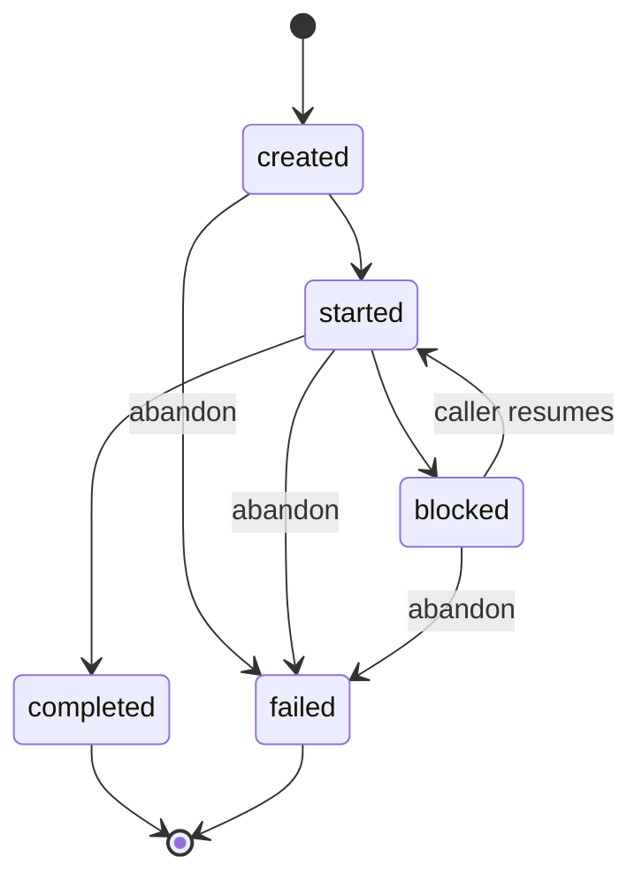
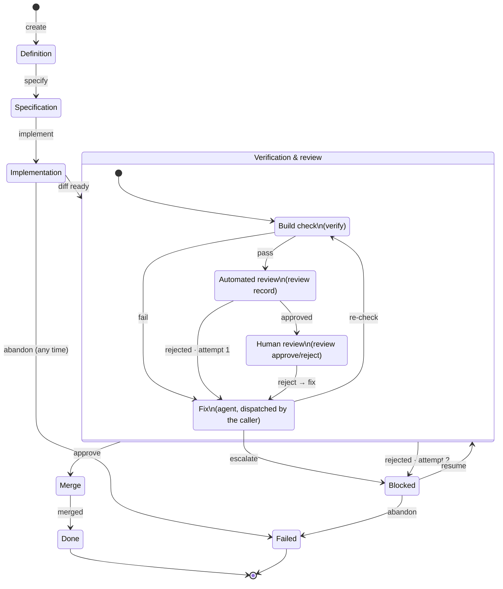

# taskman

taskman holds tasks and prompts as files, takes every directory it needs as a CLI flag, and
validates and records state transitions reported to it - it executes almost nothing itself: no
build checks, no merges, no LLM calls. Two narrow exceptions: creating a task's own worktree and
branch (§5), and reading back the commit a caller already made via `git log` rather than trusting
reported text (§6's `commit`). Everything else that requires judgment or execution is done by
whatever calls taskman, and reported back. taskman itself carries no state between invocations -
anything it needs is either already in a task file, or read fresh from git (worktree cleanliness,
a commit's real hash and message) at the moment it's needed.

## 0. Two kinds of caller, and taskman itself

Three things exist, and only one of them is this repo.

**taskman - this repo.** Knows *what to do*, never decides *when*, and executes almost nothing
itself - not `go vet`, not `git commit`, not `git merge`; those are reported to it, never run by
it. The one exception is `git worktree add` at `create` time (§5) - a single deterministic
setup step, guarded by its own clean-working-tree precondition, that has to happen exactly once
before any caller can start work. It also reads git directly in one other, read-only spot: `task
commit` reads the caller's already-made commit via `git log` rather than trusting reported text
(§6) - it never writes via git except the worktree/branch step. taskman owns the data and the
state machine: `.tasks/*.yaml` (prompt templates compiled into the binary, §4), the directories it's told to use via flags at
invocation, and the process-stage rules in §6 (what's pending, what a rejection or an escalation
means, what unblocks a task). It validates that a reported transition is legal and records it.
Exposed as a CLI (§7) - the only interface in scope. taskman assumes **nothing** about whether
anything is even listening: it never spawns a sub-agent, never calls a model API, never assumes a
particular caller exists on the other end. It answers "what's the state of this task, what should
happen next, here's the prompt for that" when asked, and accepts "here's what happened, record it"
when told.

**A harness** - unnamed, generic, not a project this design owns. This very kind of session
(Claude Code), or opencode, Codex, or any other CLI-capable agent runtime with sub-agent support,
used directly and interactively: a human (or the harness's own running LLM session) calls taskman
to read a task's state and its prompt, spawns its own sub-agents to do the implement/review/fix
work using whatever tools *it* already has, and calls taskman back to record outcomes. taskman is
just another CLI it knows how to drive. A human sitting in a chat session, polling `next` by
hand or asking their harness to, is a complete, valid way to work a task - nothing requires more
than this.

**loop - the operator, its own separate project, not in this repo.** No LLM inside it - a plain,
code-only program whose job is to run *unattended*: on a schedule, with nobody sitting in a chat
session, it polls taskman (`next`) and drives a harness (the kind above) on its own behalf
to actually do the work - shelling out to an agent CLI, calling a model API directly, whatever
it's built against - then reports the result back the same way a human-driven harness would.
loop is what makes progress happen without a human present; it is not itself the thing with
judgment (that's still whatever harness it drives) - it's the scheduler/glue that decides *when*
to invoke one.

Either kind of caller can be present, both can, or neither - taskman can't tell, and doesn't get
to assume: a task can sit in `.tasks/` indefinitely with nothing happening, and that's a valid,
unremarkable state, not an error condition. Whether anything is watching is entirely outside
taskman's knowledge.

## 1. Directories

taskman is fully offline - no network calls of its own, ever (no provider APIs, no GitHub, no
telemetry) - and has nothing to configure beyond where its files live. There is no config file:
every directory taskman needs is a CLI flag with a default, resolved fresh on every invocation.

| Flag | Default | What it names |
|---|---|---|
| `--git-dir` | `.` | The repository root taskman operates against - worktrees, commits, the clean-working-tree check (§5). |
| `--tasks-dir` | `.tasks` | Where task files live (§3). |
| `--worktrees-dir` | `.worktrees` | Where `create` creates worktrees (§5). Ignored when `create` is passed `--trunk`. |

Prompt templates (§4) aren't a directory flag at all - they're compiled into the taskman binary
itself (`go:embed`), not read from disk at runtime, so there's nothing to point a flag at.

Pass a flag to override its default for that invocation; omit it and the default applies - there
is nothing to load, parse, or validate before a command runs, and no interpolation of any kind
(no `.env`, no `${VAR}`) since there are no secrets in this picture at all. Logging verbosity is
also a flag (`--log-level`, `--log-format`), not persisted state - a one-shot process has no
reason to carry a standing logger configuration between invocations.

`.tasks/*.yaml` is the only file taskman reads and writes on its own -
content, not configuration: it grows without bound, is authored by humans or agents, and is meant
to be `git diff`-able and read on its own.

## 2. No database

Tasks and prompts are files - nothing here needs a relational store: no `internal/store`, no
migrations, no `modernc.org/sqlite` dependency.

| Data | Lives in |
|---|---|
| Directory locations | CLI flags, not persisted (§1) |
| Prompt templates | compiled into the taskman binary (`go:embed`, one per owning slice - §4) |
| Tasks, labels | `.tasks/*.yaml` |
| Build-check attempts | `.tasks/*.yaml` (`verifications:` list) |
| Review attempts | `.tasks/*.yaml` (`reviews:` list, automated; `human_reviews:` list, human - §3) |
| Tool catalog | not taskman's data at all - taskman has no tools, no tool registry, no schema field for them anywhere |

This is a from-scratch start: no existing database content migrates forward into files.

## 3. Tasks as files

### Location and identity

One file per task: `.tasks/<id>.yaml`, where `id` is `<uuid-v7>_<slug>` - a UUID v7 (sortable by
creation time) followed by an underscore and a lowercase, hyphenated slug generated from the
task's title, e.g.:

```
.tasks/01a07e83-31e1-759f-a01f-58f0f99a37c5_fix-doc-drift-in-internal-task.yaml
```

Generated once at creation, never regenerated - a UUID v7 doesn't collide, so there's no
collision case to handle the way a short slug-only id would need. `task/<id>` becomes the git
branch name (§5) - long, but still readable via the slug half. The rest of this document
abbreviates the id as `abc` in examples, for readability, standing in for the full
`<uuid-v7>_<slug>` form.

**No task YAML file is ever written or edited by hand**, including by its own creator. Every write
- create, update, a stage advancing, a human recording a review decision - goes through taskman's
own command functions (§7), which own the read-modify-write-rename cycle and validation. A
human's own interaction with a task is: read the file, inspect the worktree, then invoke a
taskman command that writes the file on their behalf.

### Schema

```yaml
task:
  id: abc
  state: started
  title: Test Task
  labels:
    type: doc-drift
    priority: high
    complexity: low
    autonomy: high
  definition: |
    ...
  specification: |
    ...
  done_when: |
    ...
  references:
    - internal/task/README.md:11
    - store.go:66-72
  status:
    definition:     { state: done, completed_at: "2026-08-31T22:46:14+03:30" }
    specification:  { state: done, completed_at: "2026-08-31T22:47:00+03:30" }
    implementation: { state: done, completed_at: "2026-08-31T23:10:00+03:30" }
    verification:   { state: done, completed_at: "2026-08-31T23:40:00+03:30", attempts: 2 }
    review:         { state: done, completed_at: "2026-08-31T23:55:00+03:30" }
    merge:          { state: pending }
  git:
    worktree: .worktrees/abc
    branch: task/abc
    commit:
      type: feat
      message: |
        ...
      hash: 12345asdf
  verifications:
    - checks: { vet: ok, lint: error, test: ok }
      output: |
        lint: internal/task/store.go:42: error not checked
      created_at: "2026-08-31T23:15:00+03:30"
    - checks: { vet: ok, lint: ok, test: ok }
      created_at: "2026-08-31T23:35:00+03:30"
  reviews:
    - attempt: 1
      approved: false
      findings:
        - file: internal/task/store.go
          detail: |
            WriteTaskFile's error return isn't checked at line 42 - if the temp-file rename
            fails, the task file still shows the old state while the caller believes the write
            landed. Needs an explicit error check and either a retry or a returned error, not a
            silent ignore.
      created_at: "2026-08-31T23:20:00+03:30"
    - attempt: 2
      approved: true
      created_at: "2026-08-31T23:38:00+03:30"
  human_reviews:
    - approved: true
      comment: LGTM
      at: "2026-08-31T23:58:00+03:30"
  # blocked is present only while task.State: blocked (§6's "blocked overlay"); omitted otherwise.
  # blocked:
  #   stage: verification
  #   reason: |
  #     Second review rejected: still missing error handling in store.go:42
  #   at: "2026-09-08T12:00:00Z"
```

This task is shown at the point where a human has just approved (`review.state: done`) and the
commit has been made, awaiting `merge` - the first automated review round found a real
issue (attempt 1, rejected), a fix went in, and attempt 2 was clean.

Notes:
- `status` stages run `definition → specification → implementation → verification → review →
  merge`, matching `notes/process.md`'s stage list - *automated* review lives inside
  `verification`, and `review` is the human gate. Each stage is `{state, completed_at}`, plus an
  `attempts` counter where a stage can retry (`verification` only, §6). No `started_at`: no
  command in this design ever reports "I've begun this stage but not finished" as a distinct
  event from "here's the outcome" - even `review`'s `in_progress` (the one real multi-value
  stage) doesn't have a clean single start/end pair once more than one reject cycle happens, so a
  field that would be `null` or ambiguous more often than not isn't worth carrying.
- `verifications`/`reviews`/`human_reviews` make a task file self-contained and portable - its
  full history travels with a `git mv` or a copy.
- `verifications` is an append-only log of every `verify` call - one entry per attempt, not
  just the latest, so a blocked task's history shows exactly which check failed and when, not
  just an aggregate pass/fail. `checks` is whatever check names the caller reported that time
  (`vet`/`lint`/`test` here, but not fixed by taskman - it's whatever the caller actually ran);
  each value is `ok` or `error`. No separate pass/fail flag - a verification attempt passed if
  every reported check is `ok`. `output` is one free-text field for the whole call, not
  per-check - if several checks fail in the same attempt, their output is whatever the caller
  concatenated into that one string; `checks` is what's structured, `output` is just supporting
  detail for a human to read.
- `labels` is a free-form `map[string]string`. A small set of well-known keys - `priority`,
  `complexity`, `autonomy`, each one of `low`/`medium`/`high` - are validated against that fixed
  enum when present. Every other key, including `type` in the example above, is an unchecked
  plain user tag - `type` isn't in the validated set despite being the most prominent example
  here; worth remembering since it's easy to assume otherwise from this schema alone.
- `reviews[]` is the **automated** reviewer's log (dispatched during `verification`, §6) -
  structured, with per-file `findings[].detail`: the full text of what was found, not a
  compressed summary - enough for a human or the next fix agent to act on without re-running the
  review. `human_reviews[]` is the **human** gate's log (§6's `review` stage) - deliberately
  flatter: one entry per `review approve`/`review reject` call, each just `{approved,
  comment, at}`. A human writes one text block, not itemized findings - `comment` might be a full
  paragraph of feedback on rejection, or literally `LGTM` on approval, or empty if the human
  didn't bother typing anything. These two logs are never merged or conflated: automated review
  lives inside `verification`; human review is its own stage, entered only after verification's
  automated round already approved.
- `blocked` is present only while `task.State: blocked`, and records which stage was in flight
  and why, rather than giving any stage its own "stuck" value (§6).
- `task.State` (top-level, coarse; the YAML key is `state`) is one of `created`, `started`,
  `blocked`, `completed`, `failed` - no `cancelled`: it would only ever mean "abandoned before any
  work happened," which `failed` (via `abandon`) already covers.

### Repository implementation

- **Read**: `os.ReadFile` + `yaml.Unmarshal`. Listing reads every `*.yaml` in the directory and
  filters in Go - no query planner to lean on, fine at this scale.
- **Write**: marshal to YAML, write to `<id>.yaml.tmp` in the same directory, `os.Rename` over
  the final path - atomic on the same filesystem, so a crash mid-write never leaves a
  half-written or corrupt task file.
- **Concurrency**: `taskman` is a one-shot CLI - each invocation is its own process that reads,
  validates, writes, and exits, not a long-running daemon holding an in-memory lock table between
  calls. Two invocations touching the same task at nearly the same moment are two separate OS
  processes, so the read-modify-write-rename cycle takes a real OS-level advisory lock (`flock`,
  held for the duration of the read-modify-write) rather than an in-process mutex - a per-process
  lock would provide no protection at all here, since there's no shared process for it to live
  in. The lock is held on a separate, stable `<id>.yaml.lock` file, never on the task file
  itself: the write's atomic rename replaces the task file's inode on every write, and a lock
  survives only as long as the inode it was opened against - locking the renamed file directly
  would let a concurrent process's fresh open onto the new inode acquire an independent,
  non-contending lock, silently defeating cross-process exclusion the moment a write ever
  succeeded. This lock is per-file, not global: two invocations against
  *different* task ids never contend at all, since they touch different files - see "Task-scoped,
  not global" below.
- **Delete**: removes the file outright, no soft-delete/tombstone - git history covers "undo."
- **IDs**: `<uuid-v7>_<slug>`, generated once at `create` time and never regenerated - the
  slug comes from the title, the UUID guarantees the filename is unique even if two tasks share a
  title.

## 4. Prompts as embedded templates

taskman has no tools and no notion of which model a task should run on (§2) - what's left to hand
a caller, for a stage that needs judgment, is exactly one thing: **text a human would otherwise
have to type into a prompt by hand.** That's a prompt file.

### Location and format

One file per stage-role, plain Markdown, no wrapper format: each stage-role's `prompt.md` lives
inside the slice package that dispatches it (`internal/task/specify/prompt.md`,
`internal/task/implement/prompt.md`, and so on for the `fix`, `review`, and `commit`
stage roles). Each is a
**user-prompt template only** - deliberately no system-prompt file, since not every harness lets
a caller override the system prompt; taskman doesn't assume that capability exists on the other
end. `{{ .Field }}` placeholders, rendered with Go's `text/template` against the task's own
fields:

```markdown
Draft a specification and acceptance criteria (`done_when`) for this task.

## Definition
{{ .Definition }}

## References
{{ range .References }}- {{ . }}
{{ end }}
```

Each file holds only the judgment-specific content - what to decide, what to look at - not the
worktree path, the branch, or what to report back with. Those are the same on every dispatch
regardless of stage, so taskman generates them once and wraps the rendered prompt in that common
preamble/postamble itself (§7's `next`) rather than have every prompt file repeat them.
`next`'s `dispatch` response carries the fully wrapped, rendered text as `message` - the
caller never touches a prompt file directly and never has to assemble the pieces itself.
Every prompt file is embedded into the taskman binary at compile time (`go:embed`, in the
Go package of the slice that owns that prompt - e.g. `internal/task/specify`) and parsed once
at startup - there's no runtime file lookup, no `--prompts-dir` flag, and no way to edit a prompt
without rebuilding taskman. Each such package also defines one typed params struct and `Render`
method per template, so a caller can't pass the wrong shape of data into the wrong template - a
compile-time guarantee, not a runtime check. This applies to
every natural-language template taskman renders, not just the five judgment-dispatch prompts
above: the dispatch preamble/postamble, the `run`/`wait`/`done` message variants, and `task
create`'s own CLI summary are each their own small embedded template too, for the same reason -
one typed struct per shape of message, never hand-built strings scattered across the command
layer.

## 5. No GitHub

taskman has no GitHub integration - no issue polling, no PR creation, no webhook. A task file
existing under `.tasks/` **is** the opt-in for working it; a human (or another agent) creating
the file is the deliberate act. There's no separate enable/disable flag - pausing a task is what
the `blocked` state is for.

**Specification stage**: a task created with only `definition` filled in (`status.specification.
state: pending`) gets `specify` dispatched (§7's `next`) to draft `specification`/
`done_when` from `definition` and any `references`, written back into the task file. A task
authored with `specification`/`done_when` already filled in skips straight to `implementation`.

**Git and worktrees**: `create` is the one place taskman executes git itself (§0). Before
writing anything, it checks the working tree at the git dir (`--git-dir`) is clean (`git status
--porcelain` empty) - if not, it errors and creates nothing, rather than leave a task file
pointing at a worktree that was never safely created. If clean, it runs `git worktree add
<worktrees-dir>/<id> -b task/<slug>` against the local repo (no clone, no network, no remote
required) and records the result as `git.worktree`/`git.branch`. This is deliberately narrow:
it's the one setup step nobody else could safely do first (a caller can't dispatch `implement`
into a worktree that doesn't exist yet, and letting every caller create its own risks two callers
racing to create the same one) - every git operation *after* this point that changes state (build
checks, commits, merges) stays caller-executed and reported, per §6; taskman's only other git
involvement is the read-only `git log` lookup in `commit` (§6). Once created, the worktree is
left in place for the rest of the task's life, inspectable at any time (`cd <worktrees-dir>/<id>`).

**`--trunk`**: `create --trunk` skips `git worktree add` entirely and records the repo root
itself as `git.worktree`, with whatever branch is currently checked out as `git.branch` (it
errors on a detached `HEAD`, since there's no branch name to record) - and sets `git.trunk: true`
on the task, the one bit of state that distinguishes it from a task whose worktree/branch just
happen to equal the repo root/current branch. The clean-working-tree precondition still applies -
it's the only thing protecting a trunk task from starting on top of someone else's uncommitted
changes, since there's no isolated worktree to fall back on. Everything downstream (`task
commit`'s `git log` read) works unchanged, since it already takes the worktree path as given
rather than assuming it's under `--worktrees-dir`. There's genuinely nothing to merge for a
trunk task, so the merge stage isn't left for the caller to close out at all:
`task.CompleteTrunkMerge`, called the moment review completes (from `commit`'s auto-approve path
and from `review approve`), marks `merge.state: done` and `task.State: completed` right there -
no separate `merge` call, no telling the caller to merge a branch into itself. Trunk mode is for
solo, sequential work where a
separate worktree/branch per task is overhead rather than isolation - concurrent tasks on the same
trunk will still collide on the clean-working-tree check, same as two callers would collide
creating the same worktree. Because the task's own `.tasks/<id>.yaml` lives in the same working
tree as the code it's tracking, a caller staging its own commit must stage explicitly (never a
blanket `git add -A`/`git commit -a`), or it risks sweeping in unrelated pending changes sitting
in that shared tree.

**No push, no PR, no remote required**: the `review` stage is just human review of a worktree and
branch - there's no PR to create. The stage's own approve/reject actions (§6) are what a human
uses instead of reviewing a PR.

## 6. The task state machine

taskman never advances a task on its own - everything below is a set of **commands** a caller
invokes, each a guarded transition taskman validates and applies. taskman's whole job is: hold
the state, tell the caller what's legal to do next (`next`, below), and refuse anything
that isn't. Every command here, including `verify` and `merge`, is the caller
*reporting* something it (or an agent it dispatched) already did - taskman never runs `go vet`,
`git merge`, or anything else itself. (`create`'s worktree/branch setup, §5, and `task
commit`'s read of the resulting commit via `git log`, are the only two exceptions in this whole
design - one writes, one only reads, and both happen where no caller could safely substitute for
taskman doing it itself.)

The stage split follows `notes/process.md`:

> **Verification** - automated verification, including lints, static code analysis, tests, and
> automated reviews... retry cap. **Review** - PR creation and human review... Ends in a commit.
> **Merge** - merge the PR into the codebase.

So the automated review round lives *inside* `verification`, not beside it; `review` is purely
the human gate; `merge` is its own terminal stage.

### Task-scoped, not global

Every command in §6's own table below takes a task id as its first argument, except `task
create` (which mints one); §7 adds `list` on top, the one command with no single task to
scope to at all. taskman has no notion of "the current task," no session, no working
directory-implied context. A caller working N tasks at once - N agents, N worktrees, N terminal
tabs, whatever - just invokes taskman N times concurrently, each call scoped to its own id, same
as invoking it once. Nothing about taskman's design assumes only one task is in flight at a time:
each command reads, validates, and writes exactly one task file (§3), and the per-file `flock`
means two commands against *different* ids never even wait on each other - only two commands
racing against the *same* id do. Multiple tasks in parallel is the default expectation, not a
special mode.

### States

**Task-level `state`:**



- `created` - task file exists, `definition` stage done, nothing else started.
- `started` - work is (or was) underway; the per-stage `status` block is the actual source of
  truth for where it stands.
- `blocked` - stopped short of a decision automation is allowed to make; see "The `blocked`
  overlay" below.
- `completed` - `merge` stage done.
- `failed` - a human gave up outright (`abandon`). Terminal.

**The full mechanism**, every stage and the verification loop:



A hand-drawn SVG rendering of the same machine lives in `notes/design/task-fsm.html`.

**Per-stage `status.<stage>.state`:**

| Stage | Values | Notes |
|---|---|---|
| `definition` | `pending` → `done` | Done the moment `create` is given a `definition` - a task without one doesn't exist yet. |
| `specification` | `pending` → `done` | Already `done` at creation if `specification`/`done_when` are provided up front; otherwise flips straight to `done` on `specify`'s report - see below for why there's no `in_progress`. |
| `implementation` | `pending` → `done` | `done` means a diff exists, not that it's clean - the build check is `verification`'s job. |
| `verification` | `pending` → `done` | Owns the build-check-fix loop and up to two automated review rounds; `attempts`/`reviews[]` already show whether work has started, so a separate `in_progress` value would be redundant. Never holds a "stuck" value itself - see the `blocked` overlay. |
| `review` | `pending` → `in_progress` → `done` | The human gate - the only stage where `in_progress` is real, entered by `review reject` and exited back to `pending` once the fix-and-recheck cycle clears (see "Review-reject recovery"). |
| `merge` | `pending` → `done` | Only two values. |

Only two values for `definition`/`specification`/`implementation`/`verification`, not three:
nothing in the command table (§6's "Commands," below) ever reports "I've started this stage but
haven't finished" - every command is a completed outcome. An `in_progress` value nothing sets is
worse than no value at all, so it's dropped for the stages where it would be unreachable.
`review` is the one exception because `review reject` genuinely sets it, and something
later genuinely clears it.

### The `blocked` overlay

Rather than give any stage its own "stuck" sub-state, escalation is one task-level fact,
orthogonal to whichever stage was active:

```yaml
blocked:
  stage: verification       # which stage's work was in flight
  reason: |
    Second review rejected: still missing error handling in store.go:42
  at: "2026-09-08T12:00:00Z"
```

Whatever stage was `in_progress` when `blocked` was set stays exactly as it was - a caller
resumes it later by calling the same command again (see "Unblocking," below). One field to check
for "is this stuck," one shape regardless of which stage triggered it.

Two things set it:
1. **`escalate`** - a caller reporting that an agent it dispatched called its own `escalate`
   tool, on its own judgment, rather than keep iterating. Can happen from `implementation`,
   `verification`, or a review-reject recovery cycle.
2. **Verification's two-round cap** exhausting itself on a second automated-review rejection.

### Commands

Every row is something the caller invokes - a CLI subcommand (§7). Each has a precondition (a
validation error if unmet, never a silent no-op) and an effect.

| Command | Precondition | Effect |
|---|---|---|
| `create --definition <text> [--id <id>] [--title <text>] [--label k=v ...] [--reference <ref> ...] [--specification <text> --done-when <text>]` | working tree at the git dir is clean | New task file. `definition` required; `id` generated as `<uuid-v7>_<slug>` if not given (slug from `--title`, §3). taskman itself creates a worktree on branch `task/<slug>` under the worktrees dir (§5's exception to "taskman never executes anything") and records them as `git.worktree`/`git.branch`. Errors instead of creating anything if the working tree isn't clean. `definition.state: done`; every other stage `pending`, `task.State: created` - unless `--specification`/`--done-when` are both given, in which case `specification.state: done` too, the specify stage is skipped (§5), and `task.State: started` immediately (matching what `specify` would otherwise be the one command to set). |
| `update <id> [--title <text>] [--label k=v ...] [--unset-label k ...] [--reference <ref> ...] [--clear-references]` | task exists | Patch semantics - only the fields given are changed, everything else on the task is untouched. No precondition on `task.State`/`status`: these are metadata, not workflow state, so a `completed`/`failed`/`blocked` task can still be relabeled without that implying anything about its progress. Doesn't touch `specification`/`done_when` (workflow content, own command: `specify`) or `git`/`status` (taskman-managed, not user-editable). `definition` isn't editable at all, by any command - it's fixed at creation (§3: "a task without one doesn't exist yet"). |
| `specify <id> --result <text> --done-when <text>` | `specification.state != done` | Writes `specification`/`done_when`; `specification.state: done`; `task.State: started`. |
| `implement <id>` | `specification.state == done`, `implementation.state != done` | `implementation.state: done`. (The diff lives in the worktree; this just marks an attempt exists.) |
| `verify <id> --check <name>=<ok\|error> ... [--output <text>]` | `implementation.state == done`, task not `blocked`/`failed` | The caller (or an agent it dispatched) ran the build checks itself (`--check vet=ok --check lint=error --check test=ok`, one per check actually run) and reports each outcome; overall pass/fail is `ok` for every `--check` given, not a separate flag - a caller can't report `passed` while also reporting a failing check. Appends to `verifications[]` (§3). Failed → recorded; expected to be followed by a fix and another `verify` call. The `blocked`/`failed` guard matches `review record`'s - a `blocked` task's two-round cap doesn't get quietly worked around by continuing the build-fix loop. |
| `review record <id> --approved <bool> [--finding <file>=<text> ...]` | `implementation.state == done`, task not `blocked`/`failed` | Reports the automated review's verdict. Appends to `reviews[]`, one `{file, detail}` entry per `--finding` given - `detail` is the full text of what was found, not a compressed summary. Approved → `verification.state: done`, `review.state: pending`. Rejected on attempt 1 → attempt becomes 2, stay in `verification`. Rejected on attempt 2 → `task.State: blocked` (`blocked.stage: verification`). |
| `commit <id> [--commit <hash>]` | `verification.state == done` | The caller already ran `git commit` itself (a new commit, never an amend) in the worktree. taskman doesn't trust caller-reported text for this - it reads the commit directly from the worktree via `git log` (`HEAD`, or the commit given by `--commit <hash>`), extracting the real `hash` and full `message`, and parsing a leading conventional-commit `type:` prefix out of the message for `git.commit.type` when present. Writes/overwrites `git.commit: {type, message, hash}`. If `auto_approve`, sets `review.state: done` directly (no `human_reviews[]` entry) and, if also `git.trunk`, completes the task right there (`task.CompleteTrunkMerge`); otherwise ensures `review.state: pending` (a no-op the first time - already `pending` - but this is what actually ends a review-reject-recovery cycle the second-or-later time, flipping it back from `in_progress`). Called once right after the automated review first approves, and again each time a review-reject-recovery cycle clears, each a distinct new commit on the branch (§ "When the commit happens"). `verification.state` stays `done` throughout recovery, so the same precondition covers every call. |
| `escalate <id> --stage <stage> --reason <text>` | task not already terminal | `task.State: blocked`, `blocked: {stage, reason, at: now}`. `stage` is one of `definition`/`specification`/`implementation`/`verification`/`review`/`merge` - whichever stage was in flight when the agent gave up. |
| `review approve <id> [--comment <text>]` | `review.state == pending` | `review.state: done`; appends `{approved: true, comment, at}` to `human_reviews[]` - `comment` is whatever the human typed, empty if they didn't bother (an approval doesn't need a comment; a human who wants to leave a quick note like `LGTM` can). If `git.trunk`, also completes the task right there (`task.CompleteTrunkMerge`) - the same as `commit` does for an auto-approved trunk task. |
| `review reject <id> --reason <text>` | `review.state == pending` | Appends `{approved: false, comment: reason, at}` to `human_reviews[]` and starts review-reject recovery (below); `review.state: in_progress` for its duration. |
| `merge <id> [--commit <hash>]` | `review.state == done` | The caller already ran `git merge` itself; records `merge.state: done`, `task.State: completed`. `--commit`, if given, overwrites `git.commit.hash` with the final merged commit (only differs from what `commit` recorded for a non-fast-forward merge). Never reached for a `git.trunk` task - `task.CompleteTrunkMerge` already completed it the moment review did. |
| `abandon <id> --reason <text>` | task not already `completed` | `task.State: failed`, reason recorded. Terminal. |
| `delete <id>` | task exists | Removes the task file outright (§3 - no soft-delete). No restriction on `task.State`/`status`: git history covers "undo," so there's nothing this precondition would protect against. A human housekeeping action, not something loop or any automated caller should invoke (§7). |
| `next <id>` | - | Read-only; see below. |

### `next`: what tells the caller what to do

The "guide it, tell it what to do, give it prompts" interface. Given a task id, it inspects
`status` and returns one of:

- **Dispatch this** - the task is at a stage needing judgment (`specification`, `implementation`,
  the fix half of `verification`, drafting the commit message once verification passes or a
  review-reject-recovery cycle clears, or the fix half of a review-reject-recovery cycle): the
  rendered prompt-template text for that stage, and which command to report the result with.
- **Run this yourself** - the task is at `verification`'s build check or at `merge`: no prompt to
  give, since neither needs judgment - run the check or the merge however you like and call
  `verify` / `merge` to report what happened.
- **Wait** - `review.state: pending` or `task.State: blocked`: the next move belongs to a human,
  not the caller. Still an open task, just not one to act on right now.
- **Done** - `task.State` is `completed` or `failed`: over, nothing will change again.

A caller that only ever calls `next` in a loop and does what it says is, by construction,
correctly driving the state machine above.

### Giving up: the `escalate` command

Neither the build-check-fix loop nor a post-rejection fix round gets a numeric retry cap.
Instead, whatever agent is dispatched for implement/fix work is expected to have its own
`escalate` tool available - the caller's own concern, not something taskman provides or
executes - and when that tool is called, the caller reports it via `escalate`. This is the
*only* bound on the build-check-fix loop - `blocked` has two distinct triggers worth telling
apart in the recorded reason ("the agent chose to stop" vs. "two automated review rounds
rejected it"), but both land on the same state and the same recovery path. The two-round review
cap and `escalate` are independent - a task can be blocked by either one, whichever comes first.

### The `verification` stage, in full

One `verification` pass is: a deterministic build check (`go vet`/`make lint`/`go test`, run by
the caller or an agent it dispatches, reported via `verify`) followed by one automated
review round (an agent the caller dispatches, reported via `review record`), against the
worktree as it stands. This gets **two attempts** before escalating, on top of either side
reporting `escalate` at any point:

1. **Attempt 1**: run the build checks, then call `verify --check <name>=<ok|error> ...` to report each one.
   - Fails → the caller dispatches a fix agent with the failure output, then runs the build
     check and calls `verify` again - repeating until it passes or the agent escalates.
   - Passes → the caller dispatches a review agent, given both `specification` and `done_when`
     as its acceptance criteria, then reports the verdict via `review record`.
     - Approved → `verification.state: done`, advance to `review`.
     - Rejected → the caller dispatches a fix agent with the review's findings, then repeats
       from `verify` for attempt 2.
2. **Attempt 2** (only reached after a review rejection): same shape as attempt 1.
   - Approved → `verification.state: done`, advance to `review`.
   - Rejected → `task.State: blocked` (`blocked.stage: verification`), reason summarizing the
     second rejection. A **fixed two-round cap for every task** - a task's `autonomy` label
     doesn't change it; predictability was preferred over per-task tunability here.

`status.verification.attempts` records which attempt (1 or 2) the task settled on; `reviews[]`
has the full per-attempt detail. A `blocked` task isn't retried automatically.

### The `review` stage: human, out of band, program-mediated

Not to be confused with automated review, which lives inside `verification` and writes to
`reviews[]` (previous section) - this stage is only about the human gate, which writes to
`human_reviews[]`. The human reviews a **real commit** on the branch - `cd <worktrees-dir>/<id>`,
`git log`/`git diff` against the base branch, their own IDE/git tooling; no in-tool diff viewer.
The commit already exists by the time this stage is reached (§ "When the commit happens" - it's
made the moment automated review approves, before `review` is ever entered). What's needed is a
way to record their decision without ever hand-editing the task's YAML file: `review
approve`, `review reject --reason ...`, `abandon --reason ...` (the release valve - a
human is never stuck rejecting forever just to avoid giving up).

**`--auto-approve`**: `create --auto-approve` records `auto_approve: true` on the task,
opting it out of this gate entirely - for solo, low-stakes work where a second, human pass adds
nothing beyond the automated review the task already went through inside `verification`. Rather
than open the gate and immediately tell the caller to close it again, `commit` skips it outright
for such a task: in the same mutation that records the commit, it sets `review.state: done`
directly instead of `pending`, with no `human_reviews[]` entry - recording one there would claim a
human decision that never happened. This also means there's no window in which `review reject`
could apply to an auto-approved task; that command's own guard (`review.state` must be `pending`)
already rules it out, since the state simply never stops there. The flag is a policy decision made
once, at creation, because `commit` has to make the same skip-or-not call every time it's asked,
from just the task file on disk - the same reason `--trunk` is stored on `git`, not re-derived per
call.

### Review-reject recovery

A human rejection re-enters automation exactly once per rejection, but skips the automated
review agent on the way back - the human is now the reviewer for this task:

1. `review reject` records the rejection in `human_reviews[]`; the caller dispatches a fix
   agent with the human's stated reason (`escalate` still available).
2. `verify` re-runs (fix-and-recheck loop, same as verification's own) until clean or
   escalated.
3. Once clean, the caller drafts a message (the `commit` prompt template again) for **a new commit** -
   not an amend of the first one - addressing the human's feedback, runs `git commit` itself, and
   reports it via `commit`, whose effect resets `status.review.state` to `pending` (§6's
   command table). The task is back in front of the human, now looking at a second commit on top
   of the first.

This can repeat indefinitely, which is fine precisely because `abandon` exists as the
explicit way out. Each cycle that clears adds one more commit to the branch, never rewriting a
previous one - a human re-reviewing after a rejection sees exactly what changed since their last
look, not the whole diff again.

### When the commit happens

Right when `verification.state` first reaches `done` - i.e., the moment automated review
approves, whether on attempt 1 or attempt 2 - **not** at `merge`, and never for a task that ends
up `blocked` instead (attempt 2's rejection sets `blocked` without ever setting
`verification.state: done`, so the commit trigger simply never fires for it - nothing worth
committing if verification never actually passed). At that point the caller drafts a commit
message (the `commit` prompt template, dispatched via `next`, §7), runs `git commit` itself, and
reports it via `commit`, which reads the real commit back out of the worktree via `git log`
rather than trusting whatever the caller says about it (§6's command table) - this is what the
human at `review` is looking at. A human rejection doesn't touch that commit; it adds a new one
on top (see "Review-reject recovery" above), so a task can end its life with one commit (no human
rejections) or several (one per rejection cycle), but never zero once it's reached `review` at
all, and never an amend.

**The task file's own commit is necessarily a separate, later one.** `git.commit.hash` is read
back from git itself, so it can only be known once the code commit already exists - a task file
committed alongside that code commit could never correctly name its own hash (a commit can't
contain, as tracked content, the hash of itself). And `review`/`merge` reaching `done` both
require commands (`review approve`, `merge`) that by construction happen after the code
commit already exists for them to act on. So no matter how it's sequenced, the task's fully final
state can't land in the same commit as its code - but rather than tell the caller to make that
commit itself, taskman makes it directly: `merge`, `abandon`, and the two ways a trunk task goes
terminal early (`commit`'s auto-approve path, `review approve`) all call
`task.RecordBookkeeping` right after the task's own state write succeeds, staging and committing
just `.tasks/<id>.yaml` with a fixed message (`chore(task): Record completion of task "<title>"
(ID: <id>)` or `Record abandonment of task "<title>" (ID: <id>)` - no quoted title, just
`(ID: <id>)`, for an untitled task). This is a third, narrow exception to "taskman executes
nothing" -
alongside `create`'s worktree setup (§5) and `commit`'s `git log` read - justified the same way:
a single, well-known file, a fixed message shape, triggered only at a state transition that
already happened. It relies on the same clean-working-tree discipline as everything else: a
caller that follows §6's staging rule (stage only what it touched) never has anything of its own
still pending in `.tasks/<id>.yaml`'s directory for this commit to accidentally sweep in.

### Unblocking a `blocked` task

There's no separate "unblock" command, and no table mapping `blocked.stage` values to a specific
resume command - `blocked.stage` is informational (what a human reads to know where to look),
not a lookup key. Resuming means calling `next` again: it inspects the *whole* current state
(`verification`/`review` states, `attempts`, `reviews[]`), not just `blocked.stage`, so it can
always tell exactly which command is next - the build-check-fix loop, an automated review, or a
review-reject-recovery cycle - the same way it would for any non-blocked task. `blocked` clears
the moment that command succeeds. A human intervening first (fixing something in the worktree
themselves, adjusting the specification) and then re-running a caller against the task *is* what
unblocks it. `abandon` is always available instead.

## 7. The taskman interface: CLI

Everything in §6's command table is reachable one way: a human, a harness, or loop, at a
terminal. `taskman verify abc --check test=ok` is a complete process lifecycle - open what
it needs, validate, write, print, exit. There is no persistent `taskman` daemon and no HTTP
interface. `taskman mcp` is the one long-running exception: the same commands, over MCP/stdio
instead of flags and stdout, for a caller that speaks MCP rather than shelling out - see
`internal/mcp`'s README for how that frontend is wired up.

### One core, thin CLI

Every command in §6 gets **one Go function** in `internal/task`, alongside the repo functions it
calls. The CLI is a few lines that parses flags into the same request struct, calls the function,
and renders the result:

```go
package task

// Command layer - one function per §6 command. Each: reads the task file, checks
// its precondition, applies the mutation via the same read-modify-write-rename
// cycle as UpdateTask (§3), and returns the updated Task or a dedicated result.

func Create(ctx context.Context, repo Repo, req CreateRequest) (Task, error)
func Update(ctx context.Context, repo Repo, id string, req UpdateRequest) (Task, error)
func Specify(ctx context.Context, repo Repo, id string, req SpecifyRequest) (Task, error)
func Implement(ctx context.Context, repo Repo, id string) (Task, error)
func Verify(ctx context.Context, repo Repo, id string, req VerifyRequest) (Task, error)
func RecordReview(ctx context.Context, repo Repo, id string, req ReviewRecordRequest) (Task, error)
func Commit(ctx context.Context, repo Repo, git Git, id string, req CommitRequest) (Task, error)
func Escalate(ctx context.Context, repo Repo, id string, req EscalateRequest) (Task, error)
func ApproveReview(ctx context.Context, repo Repo, id string, comment string) (Task, error)
func RejectReview(ctx context.Context, repo Repo, id string, reason string) (Task, error)
func Merge(ctx context.Context, repo Repo, id string, req MergeRequest) (Task, error)
func Abandon(ctx context.Context, repo Repo, id string, reason string) (Task, error)
func Next(ctx context.Context, repo Repo, prompts PromptRepo, id string) (Guidance, error)
func Delete(ctx context.Context, repo Repo, id string) error
```

(`ListTasks`/`GetTask` already exist and need no new command wrapper - they're plain reads.)
Every function validates a precondition against the current `status` and either applies the
write or returns a typed error - `ErrInvalidTransition{Stage, Have, Want}` or similar, one error
type reused by every command so the CLI only needs to handle it once. `Commit` takes a `Git`
dependency (§ "When the commit happens") because it reads the worktree's actual commit rather
than trusting caller-supplied text (§6).

### The command table

| Command | CLI |
|---|---|
| List | `taskman list [--state ...] [--label ...] ...` |
| Get | `taskman get <id>` |
| Create | `taskman create --definition <text> [--id ...] [--title ...] [--label k=v ...] [--reference ...] [--specification ... --done-when ...]` |
| Update | `taskman update <id> [--title ...] [--label k=v ...] [--unset-label ...] [--reference ...] [--clear-references]` |
| Specify | `taskman specify <id> --result <text> --done-when <text>` |
| Implement | `taskman implement <id>` |
| Verify | `taskman verify <id> --check <name>=<ok\|error> ... [--output <text>]` |
| Review record | `taskman review record <id> --approved <bool> [--finding <file>=<text> ...]` |
| Commit | `taskman commit <id> [--commit <hash>]` |
| Escalate | `taskman escalate <id> --stage <stage> --reason <text>` |
| Review approve | `taskman review approve <id> [--comment <text>]` |
| Review reject | `taskman review reject <id> --reason <text>` |
| Merge | `taskman merge <id> [--commit <hash>]` |
| Abandon | `taskman abandon <id> --reason <text>` |
| Next | `taskman next <id>` |
| Delete | `taskman delete <id>` |

Every command's name matches its Go function 1:1 (`Specify` → `specify`) - nothing invents
its own vocabulary. `Delete` is a human housekeeping action (§6) - nothing restricts calling it,
but loop and any automated caller should simply never invoke it as part of driving a task; `task
next`'s guidance never points a caller at it.

### Shared request shapes

Each `*Request` struct lives once in `internal/task`; `urfave/cli` v3 flags map onto the same
struct's fields via the command's `Action`.

The full JSON envelope is always available behind `--json` (a persistent root-command flag, for
scripting/piping); the *default*, unflagged output prints only `message` - or, for commands that
return a `Task` rather than `Guidance`, a short human-readable summary in the same spirit, not a
dump of the YAML. `create`'s summary is where "taskman tells the caller about the worktree it
just made" happens - not deferred to the first `next` call:

```
Created task abc ("Test Task"). Worktree: .worktrees/abc, branch: task/abc.
```

`next`'s `action`/`report_with` fields exist specifically for **loop**, which has no LLM
(§0) and can't act on prose at all; `--json` is how it gets them. A human just reads `message`.

### Errors, one taxonomy

| Error | CLI |
|---|---|
| `task.ErrTaskNotFound` | exit 1, `task not found: <id>` |
| `task.ErrInvalidTransition` | exit 1, states the precondition that failed |
| `task.ErrWorkingTreeDirty` (`create` only, §5) | exit 1, `working tree at <git-dir> is not clean` |
| malformed input | exit 2 |
| unexpected/internal | exit 1, generic message + logged detail |

### `next`: taskman talks, the caller listens

The guiding principle for this whole interface, stated once here because it applies everywhere:
**taskman talks to whatever's calling it the way a person talks to an agent they've delegated
work to - not a data feed an agent has to reverse-engineer intent from.** A harness reading
`next`'s response should feel briefed, the way this session is briefed by a message in this
conversation: told where to work, what the situation is, and what's expected back, in prose - not
handed a pile of separate fields (`worktree`, `since`, `attempts`, `blocked_reason`,
`last_findings`, ...) it has to reassemble into a sentence itself before it can act or brief a
human. Every prompt template already renders to natural language (§4); `next` extends
that the same way to every response it gives, not just the ones that hand off a prompt.

Concretely, every response has:

```json
{
  "task_id": "abc",
  "action": "...",
  "message": "...",
  "report_with": "..."
}
```

- `action` is a coarse signal for a caller with no way to read prose - specifically **loop** (§0
  has no LLM inside it, so it can't act on a paragraph the way a harness can): `dispatch`,
  `run`, `wait`, or `done`. loop's whole job reduces to branching on this one field and, for
  `dispatch`, handing `message` to whatever harness it's driving unread.
- `report_with` is the literal next command to call back with, when there is one (`null` for
  `wait`/`done`) - also for loop's sake, since "which CLI command comes next" is syntax, not
  narrative, and shouldn't have to be parsed out of a sentence either.
- `message` is everything else - where to work, what the situation is, what happened, what's
  expected back - written as one piece of prose. This is what a harness (or a human) actually
  reads. There is no separate `worktree`/`branch`/`title`/`since`/`attempts`/`blocked_reason`
  field alongside it; all of that is *in* the message, the same way it'd be in a sentence a
  person wrote.

**`dispatch`** - work is needed and requires judgment. `message` is the stage's prompt template
template rendered with the task's own fields, wrapped in the same worktree/branch/report-back
preamble and postamble on every dispatch (generated by taskman, not repeated in each prompt
file). A fix agent (whether from `verification`'s own loop or a review-reject-recovery cycle)
always reports back with `verify` - it produced a diff, not a verdict, so there's nothing
for it to approve or reject:

```json
{
  "task_id": "abc",
  "action": "dispatch",
  "report_with": "verify",
  "message": "Fix the issues found in the last automated review of task abc ('Test Task').\n\nWork in .worktrees/abc, on branch task/abc.\n\nFindings:\n- main.go: missing error check\n\nWhen you're done, report back with:\n    verify --check vet=<ok|error> --check lint=<ok|error> --check test=<ok|error> [--output <text>]"
}
```

Once verification passes (attempt 1 or 2) or a review-reject-recovery cycle's fix comes back
clean, the next dispatch is drafting the commit message - the one place `report_with` is
`commit` rather than a verdict-reporting command:

```json
{
  "task_id": "abc",
  "action": "dispatch",
  "report_with": "commit",
  "message": "Draft a commit message for task abc ('Test Task').\n\nWork in .worktrees/abc, on branch task/abc.\n\nSpecification:\n<task's specification>\n\nWhen you're done, run git commit yourself, then report back with:\n    commit [--commit <hash>]\n(taskman reads the commit's real message and hash itself - you don't need to repeat them)."
}
```

**`run`** - the step is mechanical, no judgment needed, so there's no prompt to hand over - just
plain instructions:

```json
{
  "task_id": "abc",
  "action": "run",
  "report_with": "verify",
  "message": "Run go vet, make lint, and go test in .worktrees/abc (branch task/abc) yourself, then report each result with:\n    verify --check vet=<ok|error> --check lint=<ok|error> --check test=<ok|error> [--output <text>]"
}
```

**`wait`** - the next move belongs to a human. Exactly two triggers, both human gates from §6,
never a catch-all for "nothing obvious to do" - and each message carries enough to brief a human
on its own, the way a person would actually say it:

```json
{
  "task_id": "abc",
  "action": "wait",
  "report_with": null,
  "message": "Task abc ('Test Task') is awaiting human review. Verification passed on attempt 1; the change is committed as 12345asdf on branch task/abc in .worktrees/abc. It's been waiting since 2026-09-08 11:40 UTC. Nothing to do until a human runs review approve or review reject."
}
```
```json
{
  "task_id": "abc",
  "action": "wait",
  "report_with": null,
  "message": "Task abc ('Test Task') is blocked in verification, waiting since 2026-09-08 12:00 UTC. The second automated review rejected it: still missing error handling in store.go:42. A human needs to look at .worktrees/abc (branch task/abc) before this can continue."
}
```
Distinct from `done` on purpose: `done` means drop this task, nothing will ever change again;
`wait` means keep it in view but stop dispatching against it until a human acts.

**`done`** - task is `completed` or `failed`:

```json
{
  "task_id": "abc",
  "action": "done",
  "report_with": null,
  "message": "Task abc ('Test Task') is complete - merged into main as 12345asdf."
}
{
  "task_id": "abc",
  "action": "done",
  "report_with": null,
  "message": "Task abc ('Test Task') was abandoned: superseded by a manual fix."
}
```

A caller that only ever calls `next`, branches on `action`, and either hands `message` to a
harness or reads it as-is, is by construction correctly driving the whole state machine.
`next` reports what the task file currently says, nothing more - it's not a lock and doesn't
know whether some other caller is already mid-dispatch against the same task; two concurrent
callers get the same answer.

### CLI framework

[`urfave/cli` v3](https://cli.urfave.org/v3/getting-started/), added via `go get`. A root `task`
command with one `cli.Command` child per row in the command table, each declaring its own
`cli.Flag`s and an `Action` that builds the shared `*Request` struct and calls straight into the
one Go function from "One core, thin CLI." `--json` is a persistent flag on the root command,
inherited by every subcommand, alongside `--git-dir`/`--tasks-dir`/`--worktrees-dir` (§1).
