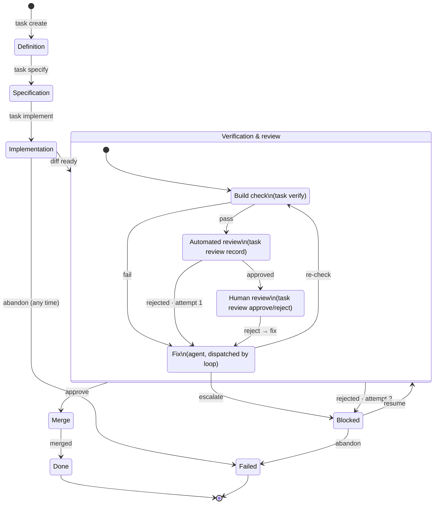

# Task State Machine (Mermaid)

Companion to `task-fsm.html` (the hand-drawn SVG version) - same machine, rendered via Mermaid
instead, kept side by side to compare rather than to replace either. Source of truth for the
design itself is `design.md` §6.

Two edges (`Fix --> Blocked`, `Blocked --> VerifyReview`) cross into/out of the nested composite
state (`Verification & review`) from outside it - Mermaid support for that pattern varies by
renderer, so this is also a test of whether it renders sensibly at all here.
